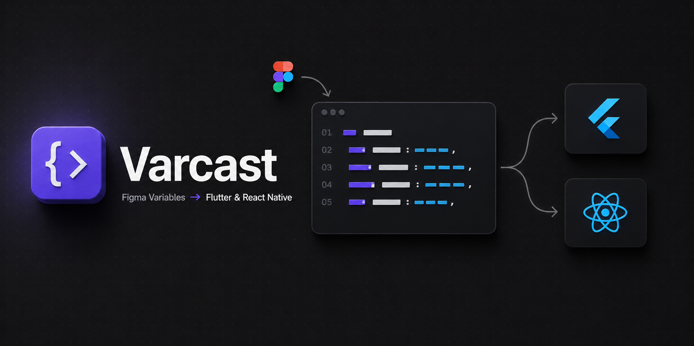

<p align="center">
  
</p>

# Varcast

Export Figma Variables and Styles to **Flutter** and **React Native** as fully-typed, mode-aware design system packages. Re-export anytime — stable identifiers survive Figma renames.

## Highlights

- Two targets, one Figma file — Flutter (Dart) and React Native.
- React Native ships **two flavors**, picked at export time:
  - **NativeWind preset** — Tailwind preset (CommonJS) + per-mode `.css` and `vars()` JS maps.
  - **Unistyles 2** — typed `light`/`dark` themes, a `buildTheme({ ...axes })` factory, and a module augmentation for `react-native-unistyles`.
- Aliases preserved as references; semantic tokens stay semantic in code. Cross-axis aliases resolve at runtime in the Unistyles flavor.
- Per-target stable manifest — Figma renames never break consumer code.
- Paint / Effect / Text styles compile into typed composite containers.
- Validates before emit: cycle detection, unresolved aliases, float-noise rounding.
- Auto-generated `CHANGELOG.md` per export.

## Usage

1. Open Varcast in any Figma file with Variables and/or local Styles.
2. Pick **Target** + **Package name**. For React Native, pick a **flavor** (NativeWind or Unistyles). Toggle which buckets to include.
3. Click **Export** — the generated package downloads as a ZIP.

## Privacy

100% client-side. No network calls. The only persistence is `figma.clientStorage` for the per-file stable-identifier manifest, scoped to the current Figma user on the current device.

## Development

```bash
pnpm install
pnpm build          # production bundle → dist/
pnpm test           # vitest
pnpm typecheck
```

Load in Figma Desktop: `Plugins → Development → Import plugin from manifest…` → pick `manifest.json`.

## License

MIT — see [LICENSE](LICENSE).
